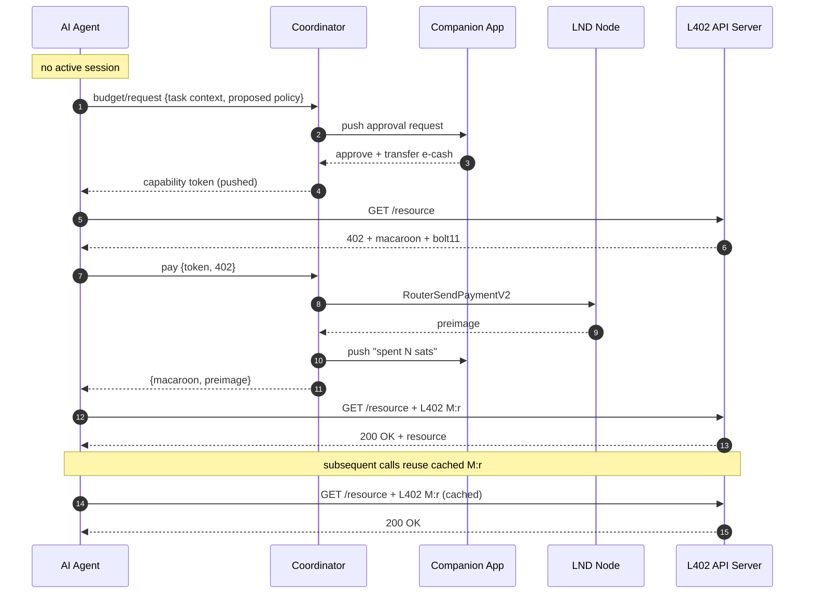
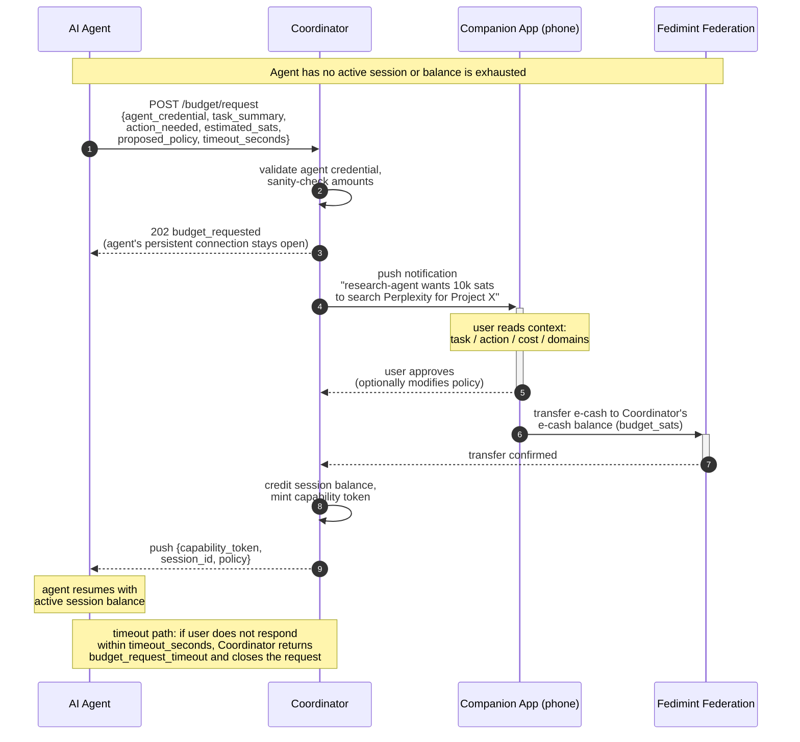
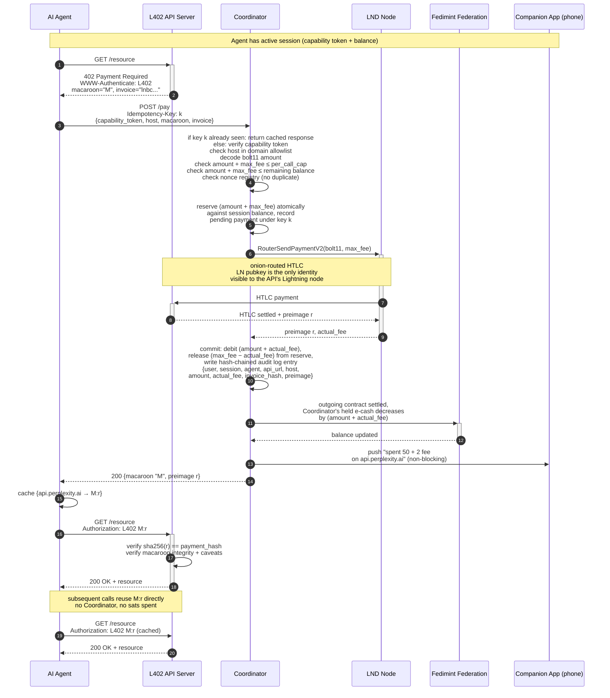

# Sorbus Specification

The detailed protocol and service specification for this project.
See [`../README.md`](../README.md) for the project overview.

## Trust and Custody Model

The service is a **privacy boundary** outwards and a **session-scoped custodian** inwards. Be explicit about both.

### External Privacy (what APIs see)

- **Lightning:** All bolt11 payments originate from our single LND node pubkey. The API server's Lightning node sees one payment source regardless of how many agents or users are behind it. Onion routing further obscures the path.
- **L402 token_id:** The `token_id` in the L402 macaroon identifier (32 random bytes) is generated by the API server per payment. It has no relationship to any user or agent identity. The Coordinator records the mapping internally but never exposes it.
- **No correlation:** Two payments from two different agents of the same user are indistinguishable to the API server. Same LND pubkey, two random `token_id`s, no link.

```
External API server sees:
  payer LND pubkey:  0279b...  (always ours)
  token_id:          a3f9...  (random, per credential)
  → cannot determine: who, which agent, how many users behind it

Internally, Coordinator knows:
  token_id a3f9... → user=alice, session=sess_42, agent=research-agent-v1
  → full audit trail, user-visible in companion app
```

### Internal Transparency (what users see)

Every satoshi spent is attributed to the user, session, and agent that caused it. The Coordinator maintains a complete audit log that the user sees as a real-time ledger in the companion app:

```
user: alice
  session: sess_42 (research-agent-v1, 10000 sats budget, expires 15:30)
    payment #1: 50 sats + 2 fee → api.perplexity.ai, 14:02:11
    payment #2: 50 sats + 2 fee → api.perplexity.ai, 14:03:44
    payment #3: 200 sats + 4 fee → api.weather.com, 14:05:01
  remaining session balance: 9692 sats
```

### v1 Custody Model (honest framing)

**During a session**, the Coordinator is a custodian over the session balance. Mechanically: when the user approves a session, the companion app transfers e-cash notes from the Fedi wallet to the Coordinator's e-cash balance (held via the `fedimint-client` library). The Coordinator now holds those notes. It tracks the session balance in its own database and decrements it as the agent spends. When the session ends, the Coordinator transfers unspent e-cash back to the user's Fedi wallet.

**Outside a session**, the user holds their own e-cash on the phone; the Coordinator holds nothing attributable to that user.

**Guardian independence**: in v1 the operator runs all guardians, so the federation's threshold model provides no additional trust reduction over single-operator custody. The Fedimint structure is a *migration path* to future guardian independence, not a v1 protection. Users trust the operator directly; the mitigation is bounded blast radius (per-session budget cap), instant revocation, a public audit log, and a published proof-of-reserves.

## System Components

```
                       ┌──────────────────────────────────────────┐
                       │            Operator Service              │
                       │                                          │
  ┌─────────────┐      │  ┌────────────────────────────────────┐  │      ┌─────────────┐
  │  AI Agent   │      │  │           Coordinator              │  │      │ L402 API    │
  │             │◄────►│  │  · agent credential registry       │  │◄────►│ Server      │
  │ agent cred  │      │  │  · session + balance accounting    │  │      │             │
  │ + session   │      │  │  · policy enforcement              │  │      │ sees only:  │
  │ capability  │      │  │  · nonce registry                  │  │      │ · our LND   │
  │ token       │      │  │  · budget request broker           │  │      │   pubkey    │
  │             │      │  │  · push broker (APNs/FCM)          │  │      │ · random    │
  │ L402 cache  │      │  │  · audit log                       │  │      │   token_id  │
  └─────────────┘      │  └────────┬───────────┬───────────────┘  │      └─────────────┘
                       │           │           │                  │
                       │           │ LND gRPC  │Fedimint mint RPC │
                       │           │           │                  │
                       │  ┌────────▼──────┐  ┌─▼────────────────┐ │
                       │  │   LND node    │  │ Fedimint Gateway │ │
                       │  │               │  │ (e-cash ↔ LN)    │ │
                       │  │ pooled        │  └────────┬─────────┘ │
                       │  │ channel       │           │           │
                       │  │ liquidity;    │  ┌────────▼─────────┐ │
                       │  │ all payments  │  │ Fedimint         │ │
                       │  │ from one      │  │ Guardians (mint) │ │
                       │  │ pubkey        │  │ operator-run v1  │ │
                       │  └──────┬────────┘  └────────▲─────────┘ │
                       │         │                    │           │
                       └─────────┼────────────────────┼───────────┘
                                 │ Lightning Network  │ e-cash transfers
                                 ▼                    │ (user-signed)
                       ┌──────────────────────────────────────────┐
                       │           Companion App (phone)          │
                       │                                          │
                       │  · e-cash balance (user-held)            │
                       │  · session creation + budget approval    │
                       │  · real-time spend ledger per agent      │
                       │  · budget request review + approve/deny  │
                       │  · session revocation                    │
                       └──────────────────────────────────────────┘
```

### Component Roles

**Agent** — software (LLM runner, bot, automation) acting on behalf of a user. Authenticates to the Coordinator over a persistent connection (WebSocket or long-poll) using its agent credential. Holds:
- A long-lived **agent credential** issued at onboarding, scoped to a user.
- A short-lived **session capability token** per active session, received by push from the Coordinator.
- A **cached L402 credential** (`macaroon:preimage`) per API it has already paid.

The agent never touches keys, e-cash, or bolt11 invoices. When it needs a budget it doesn't have, it sends a structured budget request with task context and waits for the Coordinator to push back either a fresh capability token or a denial.

**Coordinator** — the service control plane and privacy boundary. Two jobs:

*Payment gateway:*
- Authenticates agents via agent credentials.
- Enforces session policy (budget, domain allowlist, per-call cap, rate limit for paid calls).
- Validates bolt11 invoices extracted from 402 responses.
- Calls LND `RouterSendPaymentV2`, receives preimage.
- Debits the session balance (held via `fedimint-client`) after successful payment.
- Records every payment in the audit log.

*Agent–user message broker:*
- Receives budget requests from agents (with task context).
- Pushes budget requests and spend alerts to the companion app via APNs/FCM.
- Holds the request with a bounded timeout; if the user doesn't respond, returns `budget_request_timeout` to the agent.
- Routes approvals/denials back to the waiting agent over its persistent connection.
- Delivers queued notifications when the phone reconnects after being offline.

**LND node** — shared outbound Lightning liquidity. The Coordinator calls `RouterSendPaymentV2` (gRPC) and receives the preimage upon HTLC settlement. All payments originate from this one node pubkey. Channel management, rebalancing, and routing-fee optimization are operator concerns invisible to agents and users.

**Fedimint Gateway** — operator-run bridge between e-cash and Lightning. Fronts Lightning payments and is repaid from the session's e-cash balance via standard Fedimint outgoing contracts.

**Fedimint Federation (Guardians)** — operator-run in v1. The federation is the whole group; guardians are the individual servers. Issues e-cash notes; holds the cryptographic backing for balances; validates e-cash transfers between users and the Coordinator.

**Companion App** — the user's phone wallet (MVP: native app with APNs/FCM).
- Holds e-cash in the user's Fedi wallet (not custodied by us).
- Creates sessions: sets budget, domains, per-call cap, expiry, rate limit. Transfers e-cash to the Coordinator for the session.
- Reviews and approves/modifies/denies budget requests from agents.
- Displays a real-time spend ledger per agent, per session.
- Handles session revocation.

## Key Concepts

### Agent Credential vs. Session Capability Token

Two distinct credentials, issued at different times:

- **Agent credential**: a long-lived bearer (e.g., API key or macaroon) minted when the user registers an agent with their account. Scoped to `(user_id, agent_label)`. Used to authenticate the agent's persistent connection to the Coordinator. Required to *ask* for a session, but does not authorize any spending.
- **Session capability token**: a short-lived token minted when a session is created. Scoped to `(user_id, session_id)` and encodes the active policy (budget, domain allowlist, per-call cap, expiry). Required to *spend* within the session. Revocable instantly from the phone.

### Session and E-cash Custody

A **session** is the unit of spending authority. Created by the user in the companion app:

```json
{
  "user_id":         "alice",
  "agent_label":     "research-agent-v1",
  "budget_sats":     10000,
  "domain_allowlist": ["api.perplexity.ai", "api.weather.com"],
  "per_call_cap":    500,
  "expiry_seconds":  3600,
  "rate_limit":      20
}
```

When Alice confirms:
1. The companion app transfers `budget_sats` worth of e-cash notes from the Fedi wallet to the Coordinator's e-cash balance (held via `fedimint-client`). This is a standard Fedimint user-to-user e-cash transfer validated by the federation.
2. The Coordinator credits a session balance of `budget_sats` in its database, keyed to `session_id`.
3. The Coordinator mints a capability token with policy caveats and pushes it to the agent over the agent's persistent connection.

**Top-up** follows the same mechanism mid-session: the user authorizes an additional transfer of `top_up_sats`, and the Coordinator increments the session balance. The same capability token stays valid.

**Session end**: the Coordinator transfers the unspent session balance back to the user's Fedi wallet (another Fedimint transfer). For a session with `budget_sats=10000` that spent `308 sats + fees`, the refund is `10000 - 308 - fees`.

### Budget Request Context

When an agent needs authority it doesn't have, it sends a structured budget request to the Coordinator. The request carries enough context for the user to make an informed decision on their phone.

```json
{
  "agent_credential": "agt_...",
  "request_type": "new_session | top_up | policy_override",
  "existing_session_id": "sess_42",   // for top_up / policy_override
  "context": {
    "task_summary":   "Research competitors for Project X",
    "action_needed":  "Call Perplexity API for web search",
    "estimated_calls": 20,
    "estimated_sats":  5000,
    "urgency":        "blocking",
    "timeout_seconds": 300,
    "proposed_policy": {
      "budget_sats":    10000,
      "domains":        ["api.perplexity.ai"],
      "per_call_cap":   300,
      "expiry_seconds": 3600
    }
  }
}
```

`request_type` handles three cases:
- **`new_session`**: no active session; user creates one from scratch.
- **`top_up`**: existing session is running low; user transfers additional e-cash to increase the budget on the existing session.
- **`policy_override`**: a single call would exceed `per_call_cap` or hit a disallowed domain; user one-off approves that specific call without changing the base policy.

The companion app shows the agent name, task summary, action, estimated cost, and proposed policy (editable before approval), with **[Approve]** / **[Modify]** / **[Deny]** actions. While waiting, the Coordinator returns `202 budget_requested` to the agent; the agent's persistent connection stays open. If the user doesn't respond within `timeout_seconds` (bounded by the Coordinator's own ceiling, e.g. 15 minutes), the Coordinator returns `budget_request_timeout` and the agent fails gracefully.

The budget request channel is the agent's **only** way to communicate with the user. It cannot reach the user by any other path; everything flows through the Coordinator and is logged.

### L402 Credential Reuse and Renewal

L402 credentials are **reusable**. Once an agent pays for access, it caches the `macaroon:preimage` credential and reuses it on subsequent calls until the API server issues a fresh 402. Most API calls consume no sats and never touch the Coordinator.

**Renewal**: if the macaroon carries a `valid_until` caveat and the API server supports payment-based renewal, a small top-up payment to refresh the credential is cheaper than full re-authentication. The Coordinator treats a renewal 402 like any other 402 payment.

The Coordinator is only involved when a fresh 402 arrives and the agent has no valid cached credential for that endpoint.

### Lightning Fees

Every Lightning payment incurs a routing fee (typically a few sats, sometimes more on long or ill-conditioned routes). Policy:

- Each paid call debits `amount + actual_fee` from the session balance.
- `per_call_cap` and remaining budget checks apply to `amount + max_fee_estimate` (not just the L402 amount). The user cannot be surprised by a fee that blew past the cap.
- The Coordinator sets a `max_fee_sats` (or `max_fee_ppm`) on `RouterSendPaymentV2`. If no route exists within that cap, the payment fails cleanly with `fee_exhausted`; no escrow is touched.
- Fees are itemized in the spend ledger the user sees. No hidden fees.

### Nonce Registry

The Coordinator prevents double-payment of the same invoice via an `invoice_hash → {status, session_id, timestamp}` registry. Before paying any bolt11, the Coordinator verifies:
- This `payment_hash` has not been paid (or is in-flight) in any session.
- The invoice is not expired.
- The decoded invoice amount matches the amount in the 402 response header.
- The claimed source host matches the session's domain allowlist. *(We cannot cryptographically bind the bolt11 payee pubkey to an HTTP hostname without out-of-band discovery — the agent attests the origin, and the domain allowlist is the enforcement point.)*

### Macaroon Caveats (API-side)

The L402 macaroon issued by the API server can include caveats restricting access:

```
services=inference:0
inference_capabilities=query
valid_until=1700000000
```

These are the API server's business logic. The Coordinator passes the macaroon through untouched. The agent caches the full macaroon (caveats included) and presents it verbatim on retry.

## API Surface

All Coordinator endpoints are HTTPS. Agents additionally maintain a persistent WebSocket connection for server-push messages. The companion app uses HTTPS plus APNs/FCM for inbound pushes.

### Authentication

- **Agents** authenticate every HTTP request with `Authorization: Bearer <agent_credential>`. The WebSocket connection is authenticated on upgrade via the same header, then bound to a server-assigned `connection_id`.
- **Companion app** authenticates with a device-bound credential established at onboarding (`Authorization: Bearer <device_credential>`). Sensitive actions (session create, top-up, revoke, refund delivery) additionally carry a Fedimint-signed e-cash transfer or an attestation signed by the device key.
- **Capability tokens** are macaroons (consistent with L402). They are presented on `POST /pay` as `X-Capability: <macaroon>` and encode `(user_id, session_id, policy, exp, nonce)` with HMAC chain suitable for attenuation.

### Agent-facing HTTP endpoints

| Method | Path | Purpose |
|---|---|---|
| `POST` | `/budget/request` | Ask the user (via Coordinator push) for a new session, top-up, or one-off policy override. Returns `202 budget_requested` immediately; outcome delivered via WebSocket. |
| `POST` | `/pay` | Submit a 402 challenge for payment. Requires `Idempotency-Key` header. Returns `{macaroon, preimage, amount, fee}`. |
| `POST` | `/status` | Post a progress update (`session_id`, `short_message`, optional `structured`) for relay to the phone. Rate-limited per session. |
| `GET` | `/sessions/:id` | Read session policy, remaining balance, and recent ledger entries. |
| `GET` | `/sessions/:id/ledger` | Paginated ledger entries for the session. |

### Companion-app-facing HTTP endpoints

| Method | Path | Purpose |
|---|---|---|
| `POST` | `/agents` | Register a new agent; returns a fresh `agent_credential`. |
| `DELETE` | `/agents/:id` | Revoke an agent credential (freezes future budget requests and sessions). |
| `POST` | `/sessions` | Create a session. Body carries the policy and references an accompanying e-cash transfer receipt. |
| `POST` | `/sessions/:id/top-up` | Add funds to an existing session. Body references an e-cash transfer receipt. |
| `DELETE` | `/sessions/:id` | Revoke a session; triggers refund. |
| `POST` | `/budget/request/:id/decide` | Approve / modify / deny a pending budget request. Approval carries the e-cash transfer receipt; modify may adjust policy fields before approval. |
| `GET` | `/refunds` | List pending refunds addressed to this device (for offline-delivery catch-up). |
| `POST` | `/refunds/:id/claim` | Claim a pending refund. The Coordinator releases the held e-cash notes to the device. |
| `POST` | `/proof-of-reserves` | (Public, unauthenticated.) Returns the current signed attestation of `sum(active_session_balances) ≤ held_ecash`. |

### Agent WebSocket message set

All messages are JSON with `{type, id, ts, ...}`. Server messages carry a monotonically increasing `seq` per connection; clients ACK with `{type: "ack", seq}`. On reconnect the client sends `{type: "resume", last_seq}`; the server replays undelivered messages or responds `{type: "resume_failed"}` (in which case the agent must re-query `/sessions` to rebuild state).

| Direction | `type` | Payload |
|---|---|---|
| S→C | `capability_token` | `{session_id, token, policy, expires_at}` — issued on new session, top-up, or modified approval. |
| S→C | `budget_decision` | `{request_id, outcome: approved\|modified\|denied\|timeout, session_id?, token?, policy?}` |
| S→C | `policy_update` | `{session_id, policy, token}` — issued when user modifies a live session. |
| S→C | `session_revoked` | `{session_id, reason}` |
| S→C | `spend_notification_ack` | `{session_id, amount, fee, remaining}` — informational mirror of what the phone sees. |
| C→S | `ack` | `{seq}` |
| C→S | `resume` | `{last_seq}` |
| C→S | `ping` / S→C `pong` | keepalive |

## State Machines

### Session lifecycle

```
  requested
      │
      ├── deny / timeout ──▶ closed
      │
      └── approve ──▶ funding
                        │
                        ├── transfer_failed ──▶ closed
                        │
                        └── ecash_received ──▶ active

  active
      │
      ├── top_up_requested ──▶ topping_up ──ecash_received──▶ active
      │
      ├── expired         ──▶ refunding ──▶ refunded
      │
      ├── user_revoked    ──▶ refunding ──▶ refunded
      │
      └── operator_frozen ──▶ hold_period ──▶ refunding ──▶ refunded
                                   (after hold_expired
                                    or dispute_resolved)
```

Invariants:
- A session can issue capability tokens only in `active`, `topping_up`, or immediately after a `policy_update`.
- `refunding → refunded` requires either (a) a successful e-cash delivery to the companion app, or (b) a pending-refund entry the device claims later via `POST /refunds/:id/claim`.
- `operator_frozen` has a published minimum hold period (e.g. 72h) during which the user may file a dispute via the companion app.

### Payment lifecycle (`POST /pay`)

```
  received
      │
      ├── invalid ──▶ rejected
      │
      └── validated
             │
             ├── reserve_failed ──▶ rejected
             │
             └── reserved ──LND send──▶ in_flight
                                           │
                                           ├── settle  ──▶ committed  (audit + respond)
                                           │
                                           └── failure ──▶ failed     (release reserve + respond)
```

Rules:
- `validate` checks: capability token signature + expiry; host in domain allowlist; bolt11 decodes; bolt11 amount matches 402 header; bolt11 not expired; `amount + max_fee ≤ per_call_cap`; `amount + max_fee ≤ remaining balance`; `invoice_hash` not already in nonce registry.
- `reserve(amount + max_fee)` is atomic against the session balance; concurrent `/pay` calls serialize on the session row.
- `max_fee` is a single value used both for the `per_call_cap` check and as the `max_fee_sats` argument to `RouterSendPaymentV2`. The ledger debit is `amount + actual_fee` where `actual_fee ≤ max_fee` by LND's guarantee.
- `Idempotency-Key` is stored with the reservation. A retry with the same key returns the original response (including the `{macaroon, preimage}` on success) rather than re-paying or returning `already_paid`.
- On `failed`, the reservation is released in full; the nonce registry retains `invoice_hash` with status `failed` to prevent replay of a now-exposed invoice against a different session.

### Budget-request lifecycle

```
  submitted
      │
      ├── invalid / rate_limited ──▶ rejected
      │
      └── pending
             │
             ├── push_failed ──▶ rejected
             │
             └── awaiting_user
                    │
                    ├── approve ──▶ funding  (see session lifecycle)
                    ├── modify  ──▶ funding  (with modified policy)
                    ├── deny    ──▶ denied
                    └── timeout ──▶ timed_out
```

- `pending → awaiting_user` requires at least one successful push delivery OR the companion app being actively connected.
- `timeout_seconds` is clamped to `[30s, 15min]` by the Coordinator.
- A `modify` decision alters the policy fields on the pending request before transitioning to `funding`; the agent learns the final policy via the `budget_decision` WebSocket message and may abort (not redeem the token) if the modified policy is unusable.

## Error Taxonomy

All errors are returned as `{"error": "<code>", "message": "<human readable>", "details": {...}}`. Retryable means the agent may safely retry without user interaction.

| Code | HTTP | Where | Semantics | Retryable? |
|---|---|---|---|---|
| `unauthenticated` | 401 | any | Missing/invalid bearer credential | No |
| `credential_revoked` | 401 | any | Credential was revoked by the user or operator | No |
| `forbidden` | 403 | any | Credential valid but not permitted for this action | No |
| `rate_limited` | 429 | any | Per-credential or per-session rate limit hit | Yes, after `Retry-After` |
| `invalid_request` | 400 | any | Malformed body / missing field | No |
| `session_not_found` | 404 | `/pay`, `/sessions/*` | Unknown or closed session | No |
| `session_expired` | 410 | `/pay` | Session past `expiry` | No — request a new one |
| `session_revoked` | 410 | `/pay` | Session revoked by user or operator | No |
| `capability_invalid` | 401 | `/pay` | Capability token signature/expiry check failed | No |
| `domain_not_allowed` | 403 | `/pay` | `host` not in session allowlist | No — request `policy_override` |
| `per_call_cap_exceeded` | 402 | `/pay` | `amount + max_fee > per_call_cap` | No — request `policy_override` |
| `insufficient_balance` | 402 | `/pay` | `amount + max_fee > remaining balance` | No — request `top_up` |
| `invoice_invalid` | 400 | `/pay` | bolt11 does not decode or amount mismatches 402 header | No |
| `invoice_expired` | 400 | `/pay` | bolt11 expiry passed | Yes — re-fetch the 402 |
| `invoice_replay` | 409 | `/pay` | `invoice_hash` already paid or in-flight in any session | No |
| `payment_failed` | 502 | `/pay` | LND returned a terminal failure; reservation released | Yes — re-fetch the 402 |
| `fee_exhausted` | 502 | `/pay` | No route within `max_fee`; reservation released | No — request `policy_override` with higher cap |
| `liquidity_exhausted` | 503 | `/pay` | Operator has no outbound Lightning liquidity | Yes, after backoff |
| `already_paid` | 200 | `/pay` | Idempotent replay; original `{macaroon, preimage}` returned | — |
| `budget_requested` | 202 | `/budget/request` | Request accepted; outcome via WebSocket | — |
| `budget_request_denied` | — (WS) | WebSocket | User denied | No |
| `budget_request_timeout` | — (WS) | WebSocket | User did not respond within `timeout_seconds` | Yes, with fresh context |
| `budget_request_rate_limited` | 429 | `/budget/request` | Too many pending/recent requests on this credential | Yes, after `Retry-After` |
| `ecash_transfer_failed` | 502 | `/sessions`, `/sessions/:id/top-up` | Federation rejected the transfer | Yes |
| `refund_pending` | 200 | `/sessions/:id` (DELETE) | Refund queued; claim via `/refunds` | — |
| `internal_error` | 500 | any | Unexpected server-side failure | Yes, with backoff |

## End-to-End Flows

### 1. Onboarding (once)

User installs the companion app, joins the federation, and deposits Lightning sats that are minted into e-cash in their Fedi wallet. User registers each agent they plan to run; the Coordinator issues a long-lived agent credential per agent. The agent stores its credential and establishes a persistent connection to the Coordinator (reconnecting on drops).

### 2. Creating a Session (user-initiated)

User sets budget and policy in the app and taps **Authorize**. The companion app transfers `budget_sats` of e-cash to the Coordinator's e-cash balance (held via `fedimint-client`). The Coordinator credits the session balance, mints a capability token, and pushes it to the target agent over its persistent connection. No copy/paste.

### 3. Agent Requests Budget (agent-initiated)

The agent calls `POST /budget/request` with task context and one of `new_session | top_up | policy_override`. The Coordinator returns `202 budget_requested` and pushes the request to the phone. On **Approve**, the phone signs the required e-cash transfer (new session, top-up, or just an override attestation for one-off calls) and the Coordinator pushes a fresh or updated capability token back to the agent. On **Deny** or timeout, the agent receives a terminal response and fails gracefully.

### 4. Paying an L402-Gated API (no cached credential)

Agent makes the request, gets `402 Payment Required` with a macaroon and bolt11. Agent forwards the 402 to the Coordinator over `POST /pay`. The Coordinator validates the capability token, decodes the bolt11, checks `amount + max_fee ≤ per_call_cap` and `≤ remaining balance`, checks the nonce registry, then calls LND's `RouterSendPaymentV2`. LND routes the payment over Lightning and returns the preimage on settlement. The Coordinator writes an audit log entry, debits the session balance by `amount + actual_fee`, pushes a spend notification to the phone (non-blocking), and returns `{macaroon, preimage}` to the agent. The agent caches the credential and retries the original request with `Authorization: L402 M:preimage`, receiving `200 OK` and the resource.

### 5. Reusing a Cached L402 Credential

Agent sends `Authorization: L402 <cached M>:<cached preimage>` directly to the API; server verifies and returns `200 OK`. No sats, no Coordinator.

### 6. Session End

- **Natural expiry**: Coordinator transfers unspent balance back to the Fedi wallet as e-cash.
- **User revocation**: companion app sends revoke; Coordinator invalidates the capability token immediately and triggers the refund.
- **Operator revocation (abuse)**: Coordinator freezes the token, notifies the phone, refunds after a short hold period for dispute resolution.

## System Diagrams

### Overview — End-to-End Happy Path



### Budget Approval Flow (detailed)



### Payment Flow (detailed)



## Operating the Service

**Revenue**: the operator charges a small markup on each paid call — for example, a fee of `max(1 sat, amount × 1%)` added on top of the L402 amount and routing fee. This covers the capital cost of LND outbound liquidity, channel rebalancing costs (Loop, submarine swaps), federation operation, and development. The markup is transparent in the spend ledger. A subscription tier for heavy users is a reasonable extension.

**Liquidity management**: channel rebalancing (circular rebalance, Loop out/in, submarine swaps, splicing) is the operator's job. Users never see a channel. If outbound liquidity is exhausted, the Coordinator returns `503 liquidity_exhausted` to the agent rather than silently failing or masquerading as a 402.

**Audit log integrity**: the audit log is an append-only hash chain. Each entry `e_n` carries `hash(e_{n-1} || canonical_json(e_n))`. The Coordinator publishes the chain head every epoch (e.g. hourly) as a signed statement, and anchors the daily head to the Bitcoin blockchain via OP_RETURN (or an equivalent transparency log such as Sigsum). Each user can fetch an inclusion proof for any of their own entries relative to a published head, so tampering with historical entries is detectable by any user who kept a prior head. The published heads are the same artifact auditors use to verify proof-of-reserves (below).

**Proof-of-reserves**: every epoch the operator publishes a signed statement

```
{
  epoch:               <n>,
  audit_log_head:      <hash>,
  active_sessions:     [{session_id, balance_sats}, ...],
  sum_session_balances: <S sats>,
  held_ecash_commitment: <Fedimint note-set commitment>,
  held_ecash_sats:     <H sats>,
  signature:           <operator key>
}
```

with `H ≥ S` as the solvency invariant. `held_ecash_commitment` is a commitment to the Coordinator's held note set that the federation guardians co-sign (guardians can attest to the total value of notes issued to the Coordinator's `fedimint-client` without revealing note contents). Cadence: **hourly epochs, daily Bitcoin anchor, 30-day retention of all signed heads**. Any user can verify that (a) their own active session balance is included in `active_sessions`, and (b) `sum_session_balances ≤ held_ecash_sats`. A discrepancy between two published heads covering the same epoch is cryptographic evidence of operator misbehavior.

## Trust, Security, and Failure Model

| Concern | Mitigation |
|---|---|
| External APIs correlate users across payments | All payments from one LND pubkey; L402 `token_id` is random and unlinked; no user/agent data leaves the Coordinator |
| Operator can see internal payment records | Intentional and disclosed; only the operator sees the mapping; external world sees nothing |
| Operator is a custodian during active sessions (v1) | Per-session blast radius capped by user-set budget; instant revocation from phone; published proof-of-reserves; public audit log; migration path to independent guardians planned for v2 |
| Capability token theft | Short TTL; per-call cap; domain allowlist; rate limit; instant revocation; attacker bounded by remaining session balance |
| Agent credential theft | Attacker can send *budget requests* but cannot create sessions or spend — every session requires phone approval and an e-cash transfer the attacker cannot sign |
| Agent submits fraudulent budget request | Budget request is informational only — the Coordinator never creates a session unilaterally; the user must sign the e-cash transfer from their phone |
| Malicious 402 (invoice swap / inflated amount) | Coordinator decodes bolt11 and checks: amount matches 402, expiry, not already in nonce registry, host claimed by agent is in session's domain allowlist. Note: bolt11 payee pubkey cannot be cryptographically bound to an HTTP hostname; domain allowlist is the primary enforcement point |
| Session balance debited before payment settles | Debit happens only after LND returns preimage; on payment failure, balance untouched, agent receives `payment_failed` |
| Unexpectedly high routing fee | `max_fee` cap on `RouterSendPaymentV2`; `per_call_cap` check uses `amount + max_fee`; fees itemized in spend ledger |
| Channel liquidity exhausted | Returns `503 liquidity_exhausted` — not a silent failure. Operator rebalances (Loop, circular rebalance, splicing) |
| Phone offline during in-policy spend | In-policy spending continues (session balance is pre-funded, no phone round-trip needed). Notifications queued and delivered on reconnect |
| Phone offline during budget request | Coordinator returns `budget_request_timeout` after the bounded timeout; agent fails gracefully |
| Operator compelled or shut down | Guardians dissolved per Fedimint recovery protocol → Bitcoin returned; session balances unwound to e-cash back to users |

## Open Questions

**v1 scope (worth resolving before shipping):**

1. **Concurrent sessions per agent** — does an agent have one active session at a time, or can it run several in parallel (e.g., one per domain)? One-at-a-time is simpler; parallel sessions give finer-grained budgeting.
2. **Agent registration UX** — how does a user go from "I want to run this agent" to "here is an agent credential"? The mechanism needs to work for both self-hosted agents and cloud-hosted agents.
3. **Status-message schema** — `POST /status` is defined as the agent progress channel, but the structured payload shape (task tree? free-text only? typed events like `milestone` / `warning` / `finding`?) is not pinned down. Needs a minimal vocabulary before agents and the companion app can interoperate.
4. **Dispute-resolution process for operator-frozen sessions** — the session lifecycle defines a hold period, but the actual user-facing appeal channel and the operator's published abuse policy are out of scope here and need a separate document.

**v2:**

5. **Cross-federation** — v1 assumes users are on the operator's own federation. Extending to arbitrary Fedimint federations (operator as pure Lightning gateway) requires federating the transfer logic across foreign federations.
6. **Guardian independence** — moving from operator-run guardians to a real threshold federation; this is the credible path from custodial to semi-trust-minimized.
7. **Fedi app integration** — the companion app could eventually be a module inside the Fedi app, eliminating a second install.
8. **Macaroon attenuation for delegation** — a user could attenuate their capability token to give an agent a further-restricted sub-token (lower budget, narrower allowlist). Macaroon HMAC chains support this natively.

## References

- [L402 Protocol Specification](https://github.com/lightninglabs/L402/blob/main/protocol-specification.md)
- [L402 Macaroon Specification](https://github.com/lightninglabs/L402/blob/main/macaroon-spec.md)
- [L402 Agent Specification](https://github.com/lightninglabs/L402/blob/main/agent-spec.md)
- [Fedimint Documentation](https://fedimint.org/docs/GettingStarted/Why-Fedimint)
- [Fedimint Tech Components](https://fedimint.org/docs/GettingStarted/TechCompontents)
- [LND RouterSendPaymentV2 gRPC](https://lightning.engineering/api-docs/api/lnd/router/send-payment-v2)
